# BewerbRadar Copilot – Technical Architecture

Last verified: 28 July 2026

This document describes the current architecture of BewerbRadar Copilot.

It explains system boundaries and data flows. It is not a file inventory,
product plan or deployment log.

- Read `AGENTS.md` for operating and release rules.
- Read `PROJECT_CONTEXT.md` for the current product and production state.
- Read `docs/PROJECT_MAP.md` to locate implementation files for a task.
- Read `DEPLOYMENT.md` for the production runbook.

If this document conflicts with verified code or runtime behavior, investigate
the discrepancy and update the documentation.

## 1. System Overview

BewerbRadar Copilot is a standalone Next.js application derived from JadeAI.
It combines a localized resume editor, AI-assisted workflows, subscription
billing and server-rendered exports.

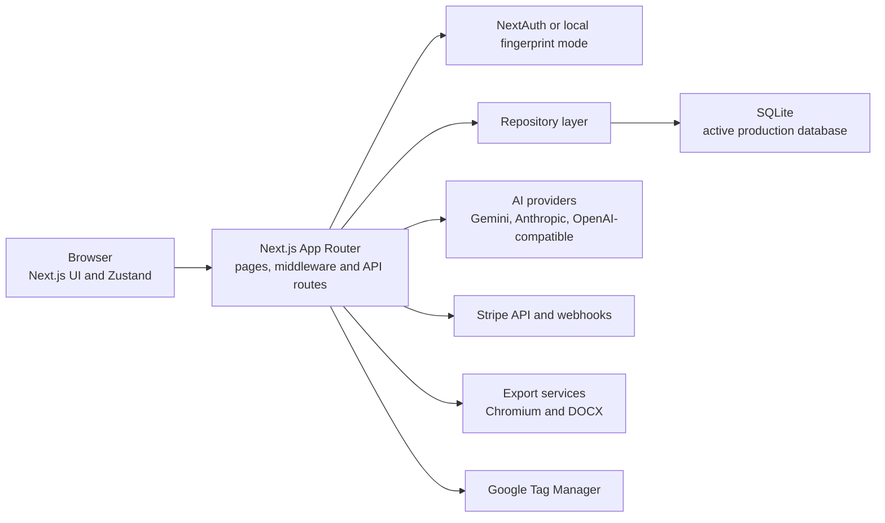

The application is deployed as one Docker service. SQLite is stored in a
persistent Docker volume. PostgreSQL, Redis and SeaweedFS exist in the wider
server stack but are not part of the Copilot's active application-data path.

## 2. Technology Stack

| Area | Current implementation |
| --- | --- |
| Web framework | Next.js 16 App Router |
| UI runtime | React 19 |
| Language | TypeScript |
| Styling | Tailwind CSS 4 and reusable Radix-based UI components |
| Client state | Zustand |
| Localization | next-intl, German and English |
| Authentication | NextAuth v5 beta, Google OAuth, Nodemailer magic links |
| Local auth fallback | FingerprintJS-derived browser identifier |
| Database | Drizzle ORM with better-sqlite3 in production |
| AI | Vercel AI SDK with Gemini, Anthropic and OpenAI-compatible providers |
| Billing | Stripe Checkout, Billing Portal and webhooks |
| PDF and images | Puppeteer/Chromium and MuPDF |
| DOCX | `docx` |
| Runtime packaging | Next.js standalone Docker image on Node.js 22 Alpine |
| Package manager | pnpm 10.29.2 |

The exact dependency versions are authoritative in `package.json`.

## 3. Runtime Layers

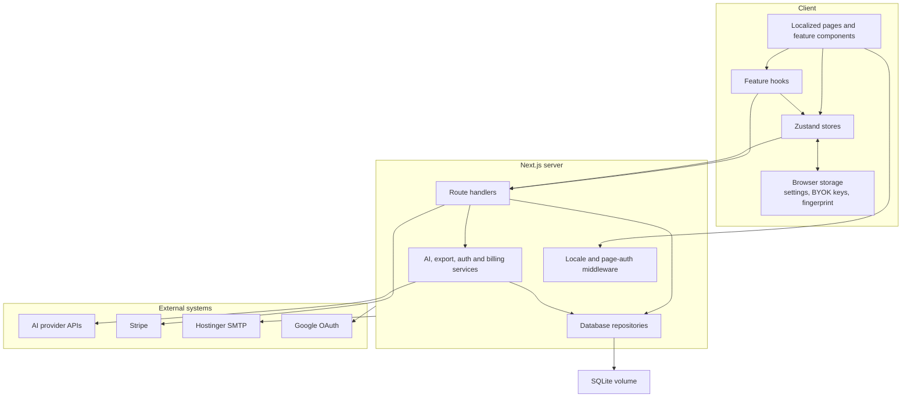

### Layer responsibilities

- Pages and components render the localized product experience.
- Hooks coordinate browser-side workflows and API requests.
- Zustand stores own editor, settings, subscription and modal state.
- Route handlers authenticate, authorize and validate requests.
- Domain modules encapsulate provider, prompt, export and billing behavior.
- Repositories own database reads and writes where practical.
- Low-level `src/components/ui/` components remain product-agnostic.

Plan restrictions and ownership checks must be enforced on the server. Client
paywalls are a user-experience layer, not an authorization boundary.

## 4. Routing, Localization and Providers

The application uses locale-prefixed App Router pages under
`src/app/[locale]/`.

Supported locales:

- `de`
- `en`

`src/i18n/config.ts` reads `DEFAULT_LOCALE` and falls back to `de`.
`src/i18n/routing.ts` supplies the configuration to next-intl.

The layouts are split by concern:

- `src/app/layout.tsx` owns global CSS, metadata, brand hydration, Consent Mode
  defaults and Google Tag Manager.
- `src/app/[locale]/layout.tsx` owns SessionProvider, runtime auth
  configuration, translations, theme, brand, tooltips and toasts.

`src/middleware.ts` performs locale routing and protects non-public page
navigation when `AUTH_ENABLED=true`. It deliberately skips API routes. API
routes therefore must call the auth helpers themselves.

## 5. Authentication and Authorization

### Production mode

Production runs with `AUTH_ENABLED=true`.

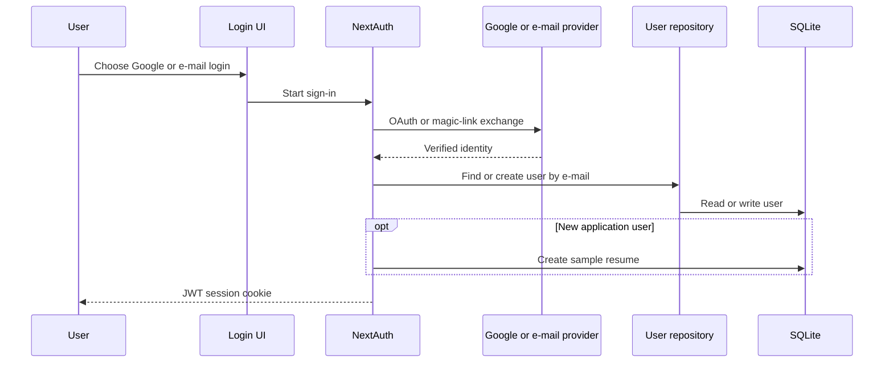

NextAuth uses JWT sessions. The callbacks map provider identities to the stable
application user ID. New Google or e-mail users receive a sample resume.

For protected API work:

1. the route calls `resolveUser()`,
2. the route rejects missing users,
3. a resource is loaded,
4. its `userId` is compared with the current application user,
5. route-specific plan rules are enforced,
6. only then is data returned or changed.

Middleware checks for the existence of an Auth.js session cookie to redirect
page navigation. It is not a replacement for route-level authorization.

### Local fingerprint mode

When `AUTH_ENABLED=false`, the browser creates or restores a fingerprint and
sends it as `x-fingerprint`.

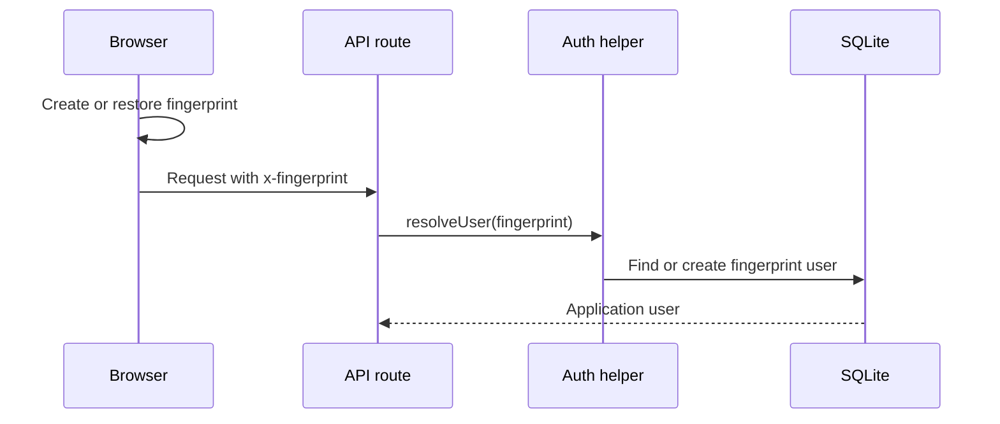

Fingerprint mode is a development/convenience identity mechanism, not a
high-assurance production authentication method.

## 6. Persistence Architecture

### Adapter selection

`src/lib/db/index.ts` selects an adapter:

- `DB_TYPE=postgresql` selects PostgreSQL.
- Any other or missing value selects SQLite.
- SQLite uses `SQLITE_PATH` or falls back to `./data/bewerbradar.db`.

Production does not set `DB_TYPE` or `SQLITE_PATH`, so the runtime uses SQLite
at `/app/data/bewerbradar.db`.

`dbReady` represents adapter initialization. Repositories should not be used
before initialization has completed.

### SQLite initialization

`src/lib/db/adapters/sqlite.ts`:

- enables WAL mode,
- enables foreign keys,
- runs migrations from `drizzle/migrations`,
- includes a compatibility fallback for `ai_imports_count`.

Migration failures are currently logged and may allow startup to continue.
This is a known reliability constraint; a running container alone does not
prove that migrations succeeded.

### Main relationships

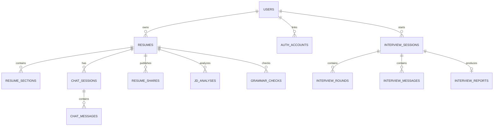

Resume section content and several result/settings fields are stored as
JSON-encoded SQLite text through Drizzle's JSON mode. Foreign-key cascades
remove dependent sections, chats, shares and analyses with their parent data.

### Schema-change contract

A production database change requires:

1. update `src/lib/db/schema.ts`,
2. update affected repositories,
3. generate and commit a SQLite migration,
4. update migration journal metadata,
5. verify Docker includes the migration,
6. test against an existing upgraded database when risk warrants it,
7. assess PostgreSQL parity explicitly.

The PostgreSQL implementation is not currently schema-equivalent to SQLite and
must not be assumed to be a drop-in production replacement.

## 7. Resume Lifecycle

### Dashboard and editor

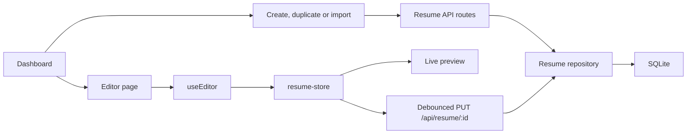

The editor loads a resume through `useEditor`, normalizes section item IDs and
places the result in `resume-store`.

Edits:

- update local state immediately,
- create undo snapshots through `editor-store`,
- update the live preview,
- mark the resume dirty,
- schedule a save using the configured autosave interval.

The update route validates the user and resume ownership, enforces Free
template restrictions, updates resume metadata and synchronizes sections.

### Template rendering

Interactive preview templates and export templates are separate
implementations:

- browser preview: `src/components/preview/templates/`
- export rendering: `src/app/api/resume/[id]/export/templates/`

A visual template change may need coordinated changes in both paths and in
dashboard thumbnails, labels and Free-template restrictions.

## 8. Resume Import

The import route accepts:

- PDF,
- PNG,
- JPG,
- WebP,
- files up to 10 MB.

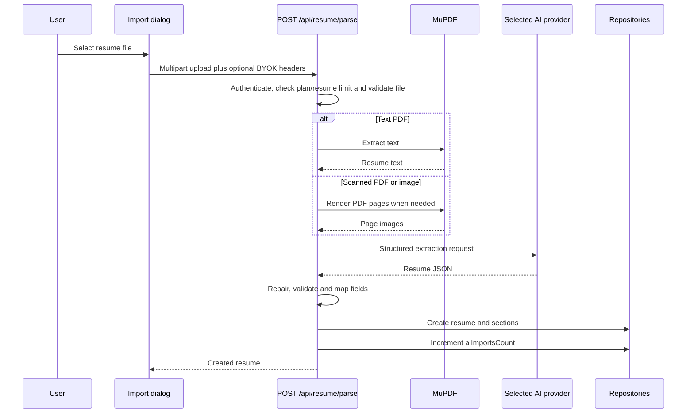

Files are converted to memory buffers and are not intentionally persisted.
Resume content and filenames must not be logged or sent to analytics.

For Free users, the server Gemini key is available exactly while
`aiImportsCount < 1` and no BYOK key is supplied. That funded first import may
create beside the one existing Free resume so the local sample or a manually
created first resume cannot erase the promised trial. After success,
`aiImportsCount` increments and the normal Free storage limit applies again.
BYOK never bypasses the storage limit.

## 9. AI Provider and Feature Architecture

### Provider resolution

Browser settings support:

- OpenAI-compatible API key, model and base URL,
- Anthropic API key and model,
- Gemini API key and model.

User keys remain in browser `localStorage`, but are sent to BewerbRadar API
routes in request headers for each AI call. They are not stored in the
application database.

`src/lib/ai/provider.ts` resolves the effective provider:

1. read provider, key, base URL and model headers,
2. detect Gemini keys beginning with `AIzaSy`,
3. detect Anthropic keys beginning with `sk-ant-`,
4. if no user key exists, decide whether the route and plan permit the server
   Gemini key,
5. force the configured server model for server-key requests.

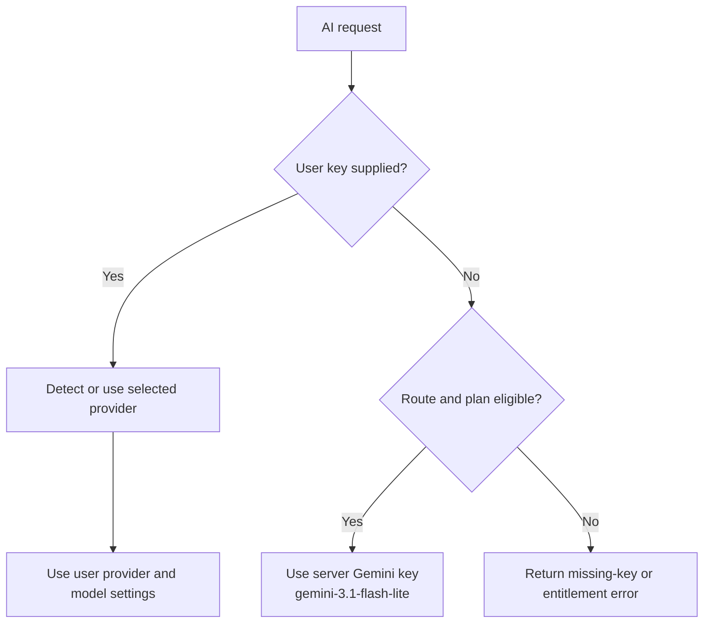

`src/lib/ai/access.ts` is the canonical server-funded decision:

- Free receives exactly one funded resume import,
- Pro receives funded resume imports,
- Premium receives funded imports and advanced AI,
- a user-provided key enables supported advanced AI without consuming the
  application provider key.

Server-funded calls also pass through a light per-user burst guard. It is a
cost and loop guardrail, not a hidden daily usage quota.

### AI resume chat

The chat route:

1. resolves the user,
2. loads the target resume,
3. verifies ownership,
4. resolves the AI provider,
5. streams model output,
6. exposes bounded resume-editing tools,
7. persists chat and tool-driven resume changes through repositories.

After tool execution, the client refreshes the resume so server-side edits are
reflected in the editor store.

## 10. Export and Public Sharing

### Export

`GET /api/resume/[id]/export?format=...` supports:

- JSON,
- TXT,
- HTML,
- DOCX,
- PDF.

The route authenticates the user, enforces plan-format rules and verifies
ownership before export.

- JSON and TXT are available on Free.
- HTML, DOCX and PDF require Pro or Premium.
- HTML is built from export templates.
- DOCX uses the `docx` implementation.
- PDF renders export HTML through system Chromium.

The production image installs Chromium and CJK-capable fonts for rendering.

### Sharing

Authenticated share-management routes:

- require ownership,
- require Pro or Premium,
- support legacy single-share fields and the newer `resume_shares` table.

The public token route:

- checks whether the link is active,
- validates an optional password,
- verifies that the owner remains on a paid plan,
- removes private ownership/password fields from the response,
- increments view count for new share records.

Public share routes require extra privacy review because they intentionally
bypass normal authenticated navigation.

## 11. Billing and Entitlements

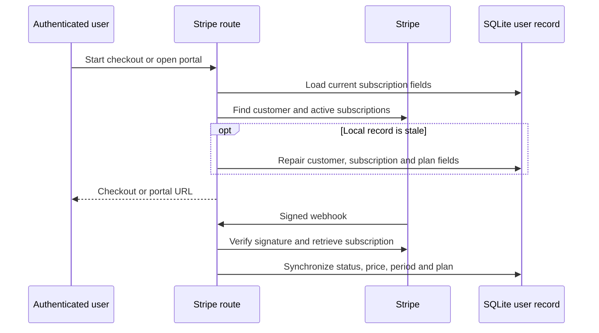

The local `users` row caches Stripe customer, subscription, price, status,
period and plan data. Checkout and portal routes validate the cached customer
against the active Stripe mode and self-heal both positive and negative state.
Only active or trialing subscriptions with a configured price grant paid
access; absent, canceled, unpaid, past-due and unknown-price subscriptions
reset the local plan to Free.

The webhook is the asynchronous source for checkout completion and
subscription updates/deletions. It must verify the Stripe signature before
changing local state. Update events retrieve the current subscription before
applying it, and subscription periods come from the current subscription-item
fields of the pinned Stripe API version.

Product entitlements still span:

- translation copy and pricing UI,
- `use-paywall`,
- subscription store,
- dashboard and template limits,
- feature dialogs,
- API routes,
- shared AI provider logic,
- Stripe price-to-plan mapping.

A plan change must trace all of these layers. Client components are not trusted
as entitlement boundaries; `src/lib/ai/access.ts` owns server-funded AI access
and API routes remain responsible for ownership and plan enforcement.

## 12. Analytics and Consent

`src/app/layout.tsx` initializes Google Consent Mode v2 to denied before loading
GTM `GTM-55XL7PR4`.

Current flow:

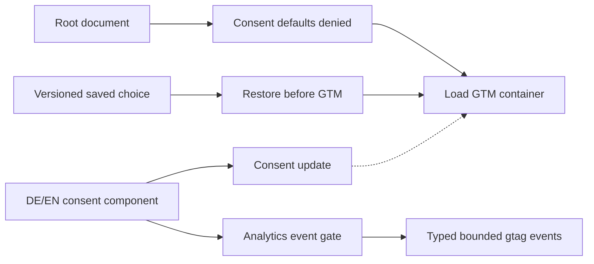

Relevant implementation:

- `src/app/layout.tsx` owns denied defaults, saved-choice restoration and GTM
  loading,
- `src/lib/analytics/consent.ts` owns versioned consent persistence and Consent
  Mode updates,
- `src/components/consent/cookie-consent-banner.tsx` owns the German and English
  choice UI,
- `src/lib/analytics/index.ts` owns the typed event contract, consent gate,
  property allowlists and the single product-event data-layer path,
- `src/components/analytics/analytics-actions.tsx` contains small client actions
  for server-rendered landing sections.

GTM version 3 contains the GA4 Google tag for `G-6XRD25H13C`, and GA4 Realtime
has received BewerbRadar page views. Repository instrumentation, production
observation and causal validation remain separate evidence states; explicit
product-event receipt must be rechecked after deploying its `gtag` transport.

Analytics events must never include resume content, filenames, contact data,
e-mail addresses, user identifiers, resume identifiers, API keys, prompts,
model responses or free-form errors.

## 13. Production Runtime

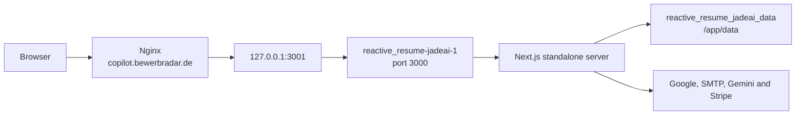

Production layout:

- application repository: `/var/www/jadeai`,
- central Compose file: `/var/www/bewerbradar/compose.yml`,
- Compose service: `jadeai`,
- container: `reactive_resume-jadeai-1`,
- host mapping: `127.0.0.1:3001` to container port `3000`,
- persistent data: `reactive_resume_jadeai_data:/app/data`,
- Nginx domain: `https://copilot.bewerbradar.de`.

The Dockerfile:

1. installs dependencies with the lockfile,
2. creates a Next.js standalone build,
3. installs system Chromium and fonts,
4. copies static assets and Drizzle migrations,
5. declares `/app/data` as persistent data,
6. starts `node server.js`.

Production release mechanics and verification are defined in `DEPLOYMENT.md`.

Operational safety is intentionally small but layered:

- each deployment creates and integrity-checks a consistent SQLite backup
  before rebuilding the application,
- a systemd timer repeats that backup daily and retains 14 days by default,
- Hostinger full-VPS backups provide the separate infrastructure layer,
- a scheduled GitHub workflow probes the public health and landing endpoints
  and maintains one incident issue until recovery.

The public health route checks database initialization and returns `503` when
SQLite storage falls below the configured free-space threshold, allowing the
external probe to surface both application failure and imminent disk pressure.

## 14. Environment Boundaries

Environment variables select runtime integrations; secret values never belong
in Git or documentation.

Important groups:

- app URL, name, locale and GTM container,
- auth secret and provider credentials,
- SMTP credentials,
- database adapter and path,
- server Gemini key,
- Stripe secret, webhook secret, price and optional coupon IDs,
- Stripe legal and automatic-tax readiness flags,
- optional server-funded AI burst-guard settings.

Known configuration discrepancy:

- application runtime defaults SQLite to `./data/bewerbradar.db`,
- `.env.example` currently shows `SQLITE_PATH=./data/jade.db`.

Production does not set `SQLITE_PATH`, so `bewerbradar.db` is active. The
example should be aligned in a separate, reviewed configuration change.

## 15. Current Architectural Constraints

1. SQLite is the production authority; PostgreSQL parity is incomplete.
2. Migration errors may not stop startup.
3. There is no established automated unit or end-to-end test suite.
4. Non-AI plan checks still span UI, stores and API routes and must be traced
   together when the product matrix changes.
5. Preview and export templates can drift because they are separate renderers.
6. API protection is route-specific because middleware skips `/api`.
7. BYOK secrets transit the BewerbRadar backend even though they are stored
   only in the browser.
8. Production health monitoring is intentionally minimal and relies on the
   public health route plus a scheduled GitHub workflow.
9. GA4 page-view receipt is verified; the Phase 7 explicit product-event path
   still needs post-deployment Realtime or DebugView evidence.
10. Deployment is fail-fast but remains a rebuild-and-restart flow rather than
    a transactional blue/green release.
11. AI chat-session routes do not consistently enforce resume/session
    ownership before repository access.
12. Some AI error/debug paths log raw model output that may contain resume
    content.

These constraints are not all release blockers. They define where changes need
stronger review and verification.

## 16. Architecture Change Checklist

Before changing a cross-cutting feature:

1. use `docs/PROJECT_MAP.md` to identify the full path,
2. trace UI → hook/store → API → service → repository/database,
3. verify authentication, ownership and plan enforcement,
4. review German and English copy,
5. review PII and secret handling,
6. add a migration for schema changes,
7. check preview/export parity for presentation changes,
8. run verification proportional to risk,
9. update the durable documentation affected by the change.
